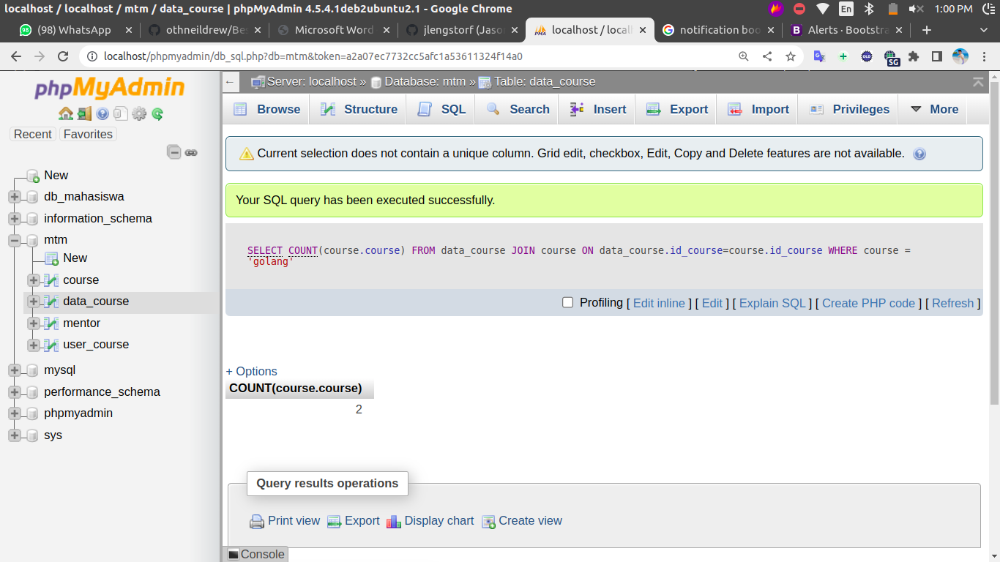

# Tes kemampuan mtm

## 1. CRUD
pada soal nomor 1 ini di perintahkan untuk membuat CRUD atau cread, read, update, dan delete. dan pada jawaban saya ini saya menggunkan content tabel backend yang ada pada soal no 2

untuk hasilnya adalah sebagain berikut

- Read

- Cread

- Update

- Delete

## 2. Menampilkan isi tabel database menggunakan query
pada soal nomor 2 diperintahkan untuk menampilkan beberapa data menggunakan query

berikut adalah tabel soal

untuk membuat databasenya, tadi flat tabel di atas saya buat menjadi 4 tabel
yang pertama adalah tabel mentor, tabel mentor ini berisi nama mentor dan id_mentor yang digunakan sebagai primary key.

tabel yang kedua adalah tabel course tabel ini berisi nama course dan id_mentor sebagai forign key yang di relasikan dengan tabel mentor

kemudian dikarenakan disini banyak member dapat memilih banyak kursus membuat jenis relasi menjadi many to many, karena hal tersebut memerlukan 2 tabel lagi yaitu tabel user_course dan data_course

user_course berisi nama member yang mengikuti kursus, kemudian untuk data_course berfungsi sebagai penghubung antara member course dan course, jadi banyak member dapat memilih banyak course

kesimpulan dari deskripsi di atas didapatkan ERD sebagai berikut

## berikut adalah soal dan jawaban yang sudah saya sajikan dengan bukti gambar

1. Siapakah mentor yang paling banyak ambil course?

SELECT mentor.mentor, COUNT(course.id_mentor)as jumlah_course 
FROM mentor  JOIN course ON mentor.id_mentor=course.id_mentor 
GROUP BY course.id_mentor
ORDER BY jumlah_course desc
LIMIT 1

2. Berapa banyak yang ambil course Golang?

3. Siapakah member yang paling banyak ambil course? 

